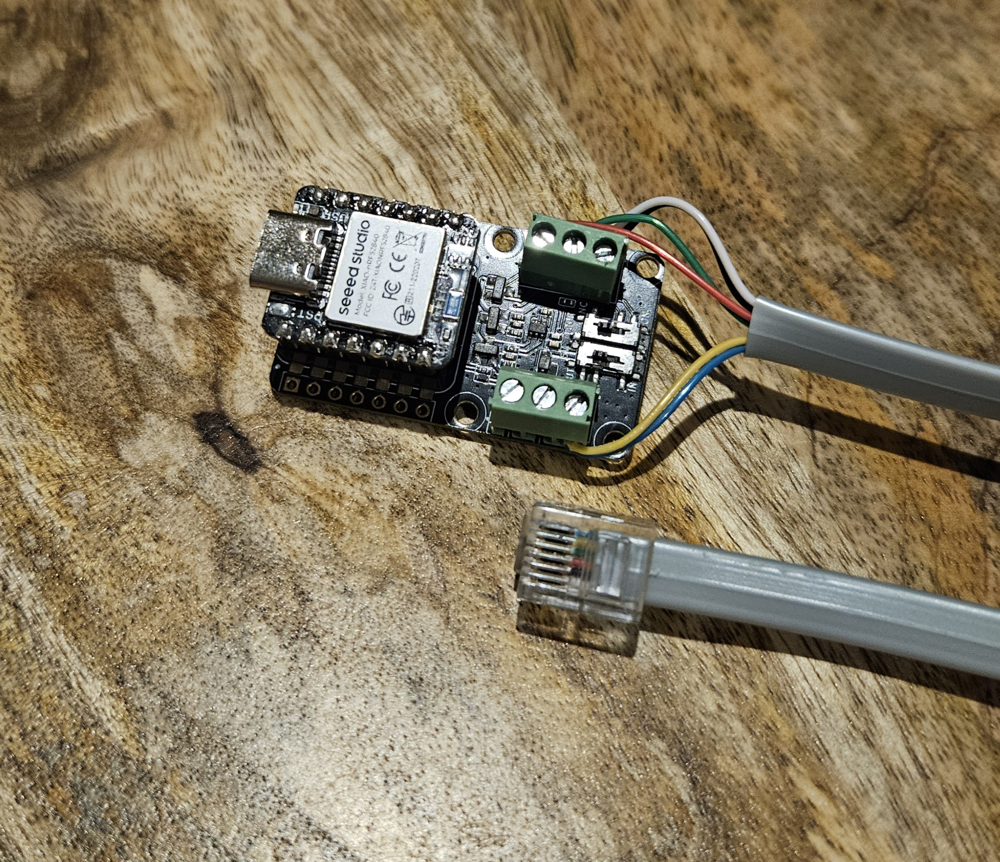

# Flexit CS60 Control

This project is for creating a zigbee device to remotely monitor and control a Flexit CS60 ventilation unit via it's RS485 bus.

It can be connected to extra RJ12 contact on a Flexit CI60 panel connected to CS60, or directly to RJ12 on CS60 unit.

Inspired by https://github.com/MSkjel/esphome-flexit-modbus-server.

## Features

### Zigbee 

Inputs displayed and controllable via Zigbee device:
- Fan speed (mode): Off, min, normal, max. (the presets normally adjusted via CI60 panel, with the addition of off.)
- Supply air setpoint. Allows adjusting the target of Supply air temperature, which the heat exchanged tries to reach.

Sensor values exposed via zigbee:
- Supply air temperature is exposed as the main temperature sensor.
- Intake air temperature is exposed as a AnalogInput sensor.
- Heat exchanged percentage
- Heating eleent percentage
- Also binary on/off alarm signals
    - Filter change
    - Heat exchanger faulty
    - Outdoor air sensor faulty
    - Overheat triggerd
    - Supply air sensor faulty

    Actual triggering of these alarms has not been tested at the time of writing this.

Zigbee functionality has been tested in Home Assitant, on ZHA. For the Supply air setpoint, a quirk must be added. See _tools/zha-quirk/flexit-cs60-control.py_

### Bluetooth

Bluetooth is used for development/debugging/managment.

The project is set up so that new firmware can be uploaded and activated through the `ble-client` cli provided in _tools/ble-client directory_.

The `ble-client` is also used to stream raw RS485 data to connected PC client, to reverse engineer and troubleshoot the connection to CS60. It can also erase stored zigbee pairing.

Compile it and run `ble-client` to see available commands.

## Caveats
The source hardcode to modbus address 1, to be able to set Supply air temperature setpoint. Cannot be used with CI600 panel with this address set. Works well with CI60 panel.

## Hardware needed

- Flexit ventilation system with CS60 (or similar) controller
- XIAO BLE (nRF52840) (https://wiki.seeedstudio.com/XIAO_BLE/)
- XIAO RS485 expansion board (https://wiki.seeedstudio.com/XIAO-RS485-Expansion-Board/)
- RJ12 cable
- [Nordic nRF52840 development kit](https://www.nordicsemi.com/Products/Development-hardware/nRF52840-DK) (or other solution for flashing bootloader on XIAO BLE with SWD connection)

## Setup

The XIAO BLE comes with Adafruit Bootloader. This project is made to use
nordic SDK MCUboot. Flash it via SWD connection (using nRF52840 development kit, or other Jlink) the first time, then you can use USB or Bluetooth to update firmware after, if needed.

1. Install and set up Nordic SDK (version 3.3.0).
2. Connect XIAO BLE SWD pins to JLink (on nRF52840DK). Example here: https://www.ericbariaux.com/posts/xiao_nrf52840_swd/ 
3. Flash MCUBoot bootloader to XIAO BLE.

After this, disconnect XIAO BLE from nRF52840DK SWD pins, and connect it via USB to flash using nordic SDK tools.

**Bluetooth passkey:** env variable `FLEXIT_CS60_CONTROL_BLE_KEY` must be set to a 6 digit number when building, and when using bluetooth client. It is a secret key for connecting via bluetooth.

See further info in CLAUDE.md for building and flashing.

When the application has been built and flashed to XIAO BLE, hook it up as shown in image:

- Yellow and blue is 12V
- White and black is GND
- Red is RS485 A signal
- Green is RS485 B signal

Connect RJ12 to CS60 or CI60 panel connected to CS60. Then pull power plug on CS60 to restart it. This is needed for the device to be acknowledged by CS60.

## LED signalling on XIAO BLE with firmware installed
### Green led
- Blinks every 100ms when zigbee is open for pairing. (60 seconds)
- Constant on when zigbee is connected.
- Otherwise, blinks every second. (Not connected, and not open for pairing)

### Blue led
- Constant on when a client is connected through BLE.

### Red led
- Constant on if some application init fails.
- Blinks if valid RS485 signal is not read. This might indicate that you need to power cycle CS60 ventilation unit while this is connected with RJ12, since the RS485 init only happens when CS60 starts.

## License
MIT

## Disclaimer

The source was mainly written by Claude Code and has not been reviewed in detail. The main functionality has been tested to work as intended connected to CS60 and Home Assistant zigbee (ZHA).